# Air Monitoring Project - Architecture Diagrams (C4 Model)

## Level 1: System Context Diagram

Muestra el sistema completo y sus interacciones con actores externos.

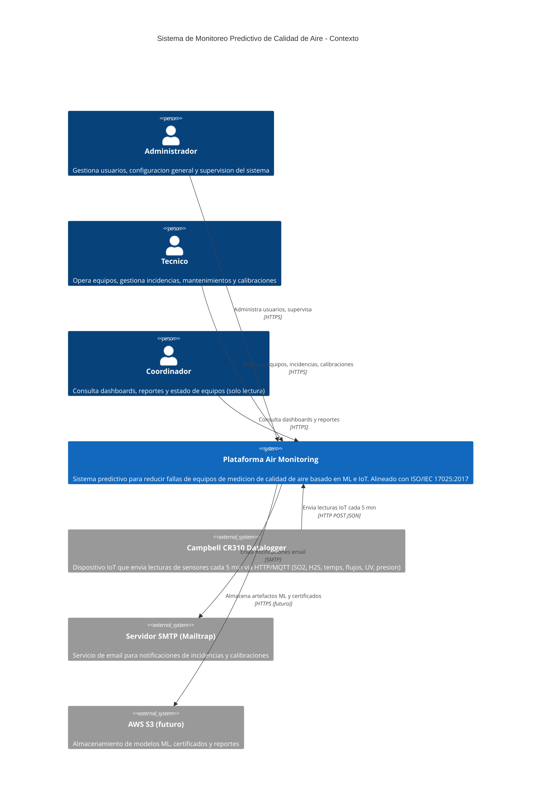

---

## Level 2: Container Diagram

Muestra los contenedores (servicios desplegables) que componen el sistema.

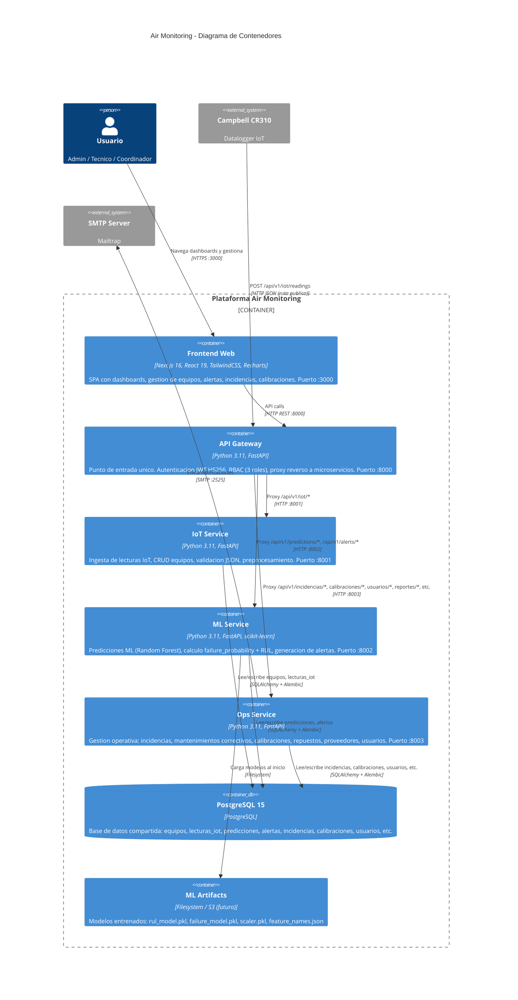

---

## Level 3: Component Diagram - API Gateway

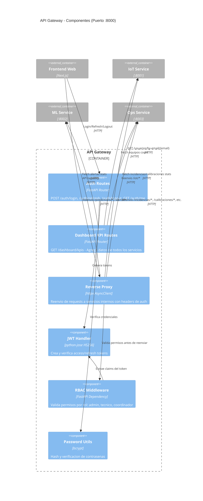

---

## Level 3: Component Diagram - IoT Service

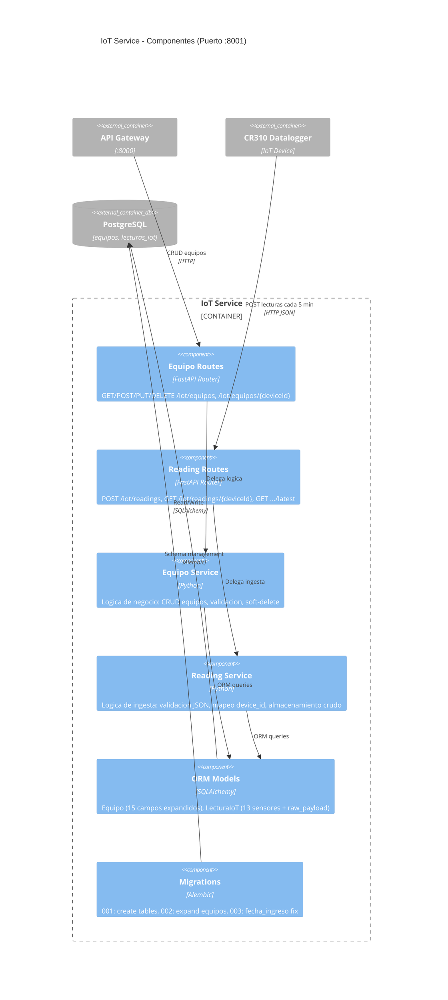

---

## Level 3: Component Diagram - ML Service

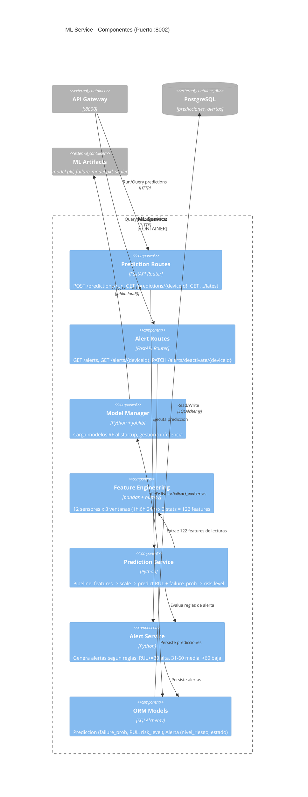

---

## Level 3: Component Diagram - Ops Service

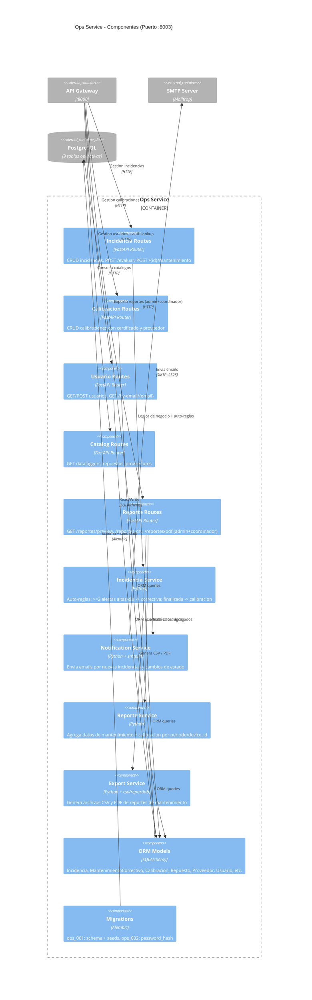

---

## Level 3: Component Diagram - Frontend

```mermaid
C4Component
    title Frontend Web - Componentes (Puerto :3000)

    Person_Ext(user, "Usuario")
    Container_Ext(gateway, "API Gateway", ":8000")

    Container_Boundary(frontend, "Frontend Next.js") {
        Component(auth_provider, "AuthProvider", "React Context", "Gestiona JWT tokens, auto-refresh, redirect a /login en 401")
        Component(route_guard, "RouteGuard", "React Component", "RBAC en cliente: redirige por rol (admin->dashboard, tecnico->dashboard-tecnico, coordinador->dashboard)")
        Component(login_page, "Login Page", "Next.js Page", "/login - Formulario email/password")
        Component(dashboard_page, "Dashboard Page", "Next.js Page", "/dashboard - Layout con 8 widgets + HealthSemaforo, polling cada 30s (admin+coordinador)")
        Component(dashboard_tecnico, "Dashboard Tecnico", "Next.js Page", "/dashboard-tecnico - KPIs de incidencias pendientes, repuestos disponibles (solo tecnico)")
        Component(equipo_detail, "Equipo Detail", "Next.js Page", "/equipos/[deviceId] - Vista 360° con tabs")
        Component(crud_pages, "CRUD Pages", "Next.js Pages", "/incidencias, /calibraciones, /alertas, /predicciones, /lecturas, /repuestos, /proveedores, /usuarios")
        Component(reportes_page, "Reportes Page", "Next.js Page", "/reportes - Preview/exporta CSV+PDF de mantenimiento (admin+coordinador)")

        Component(kpi_cards, "KpiCards", "React + TailwindCSS", "4 metricas: Equipos, Alertas Altas, RUL Promedio, Predicciones")
        Component(health_semaforo, "HealthSemaforo", "React + TailwindCSS", "Indicador visual de salud global del sistema por nivel de riesgo")
        Component(charts, "Chart Components", "Recharts (dynamic import)", "PredictionTrends, SensorTrends, RiskDistribution (Pie)")
        Component(data_widgets, "Data Widgets", "React + TailwindCSS", "EquipoGrid, RecentAlerts, IncidenciasSummary, ProximasCalibraciones")

        Component(api_client, "API Client", "fetch + interceptors", "Agrega Bearer token, maneja 401, routing a gateway")
        Component(api_functions, "API Functions", "TypeScript modules", "dashboard.ts, auth.ts, predicciones.ts, ops.ts, lecturas.ts")
    }

    Rel(user, login_page, "Ingresa credenciales")
    Rel(user, dashboard_page, "Visualiza metricas y estado (admin/coordinador)")
    Rel(user, dashboard_tecnico, "Visualiza incidencias y repuestos (tecnico)")
    Rel(user, equipo_detail, "Inspecciona equipo individual")
    Rel(user, crud_pages, "Gestiona entidades operativas")
    Rel(user, reportes_page, "Exporta reportes (admin/coordinador)")

    Rel(login_page, auth_provider, "Almacena tokens")
    Rel(auth_provider, route_guard, "Provee rol y estado auth")
    Rel(route_guard, dashboard_page, "Redirige admin/coordinador")
    Rel(route_guard, dashboard_tecnico, "Redirige tecnico")
    Rel(dashboard_page, kpi_cards, "Renderiza KPIs")
    Rel(dashboard_page, health_semaforo, "Renderiza estado de salud")
    Rel(dashboard_page, charts, "Renderiza graficos")
    Rel(dashboard_page, data_widgets, "Renderiza grids y tablas")
    Rel(equipo_detail, charts, "Charts por equipo")

    Rel(api_functions, api_client, "Usa interceptor HTTP")
    Rel(api_client, gateway, "HTTP REST con JWT", "HTTPS :8000")
    Rel(auth_provider, api_functions, "Login/Refresh calls")
    Rel(dashboard_page, api_functions, "Fetch data")
    Rel(dashboard_tecnico, api_functions, "Fetch incidencias + repuestos")
    Rel(equipo_detail, api_functions, "Fetch data")
    Rel(crud_pages, api_functions, "CRUD operations")
    Rel(reportes_page, api_functions, "Fetch preview + download CSV/PDF")
```

---

## Deployment Diagram (Docker Compose - Desarrollo)

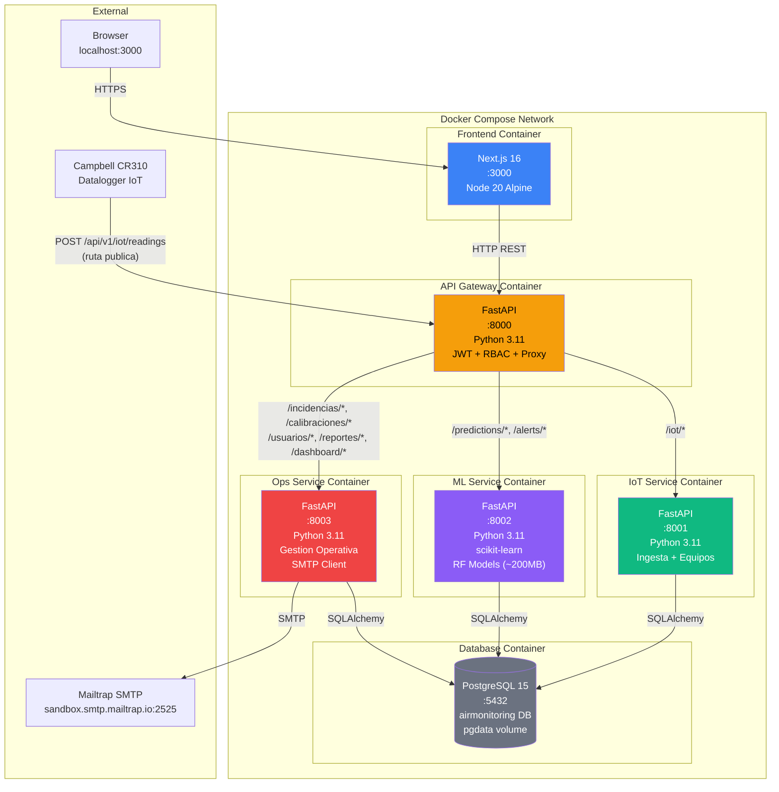

---

## Data Flow Diagram - Flujo de Prediccion

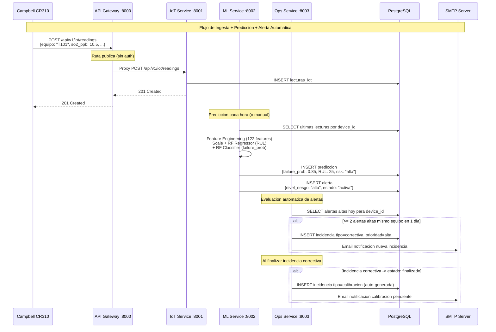

---

## Entity Relationship Diagram

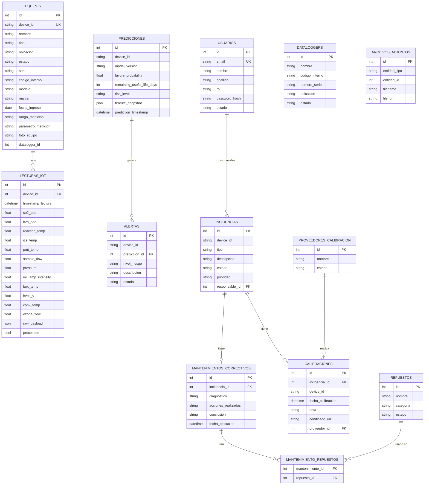

---

## CI/CD Pipeline

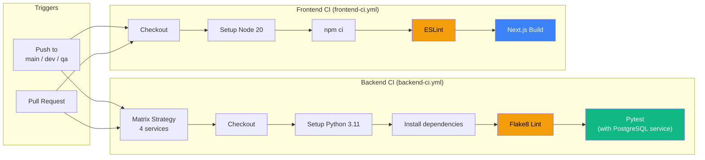

---

## Resumen de Decisiones Arquitectonicas

| Decision | Eleccion | Justificacion |
|----------|----------|---------------|
| Patron de comunicacion | Proxy reverso centralizado (API Gateway) | Punto unico de auth, RBAC y entrada |
| Base de datos | PostgreSQL unico, esquemas separados por Alembic | Simplicidad MVP, migraciones independientes |
| FK entre servicios | Sin FK cross-service (device_id como string) | Desacoplamiento de microservicios |
| Autenticacion | JWT HS256 propio | Evitar dependencia AWS Cognito en MVP |
| ML Runtime | Modelos cargados en memoria al startup | Latencia minima en inferencia |
| Frontend SSR | Next.js con dynamic imports (Recharts) | Bundle optimizado, SSR-capable |
| RBAC Frontend | RouteGuard + rol-por-ruta en cliente | Tecnico ve solo /dashboard-tecnico; admin/coordinador acceden a /reportes |
| Email | SMTP directo (Mailtrap dev) | Simplicidad, sin dependencia SaaS |
| Almacenamiento archivos | URLs string (S3 futuro) | Defer infraestructura cloud post-MVP |
