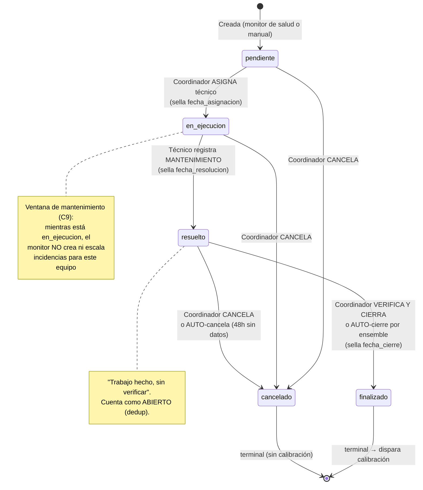
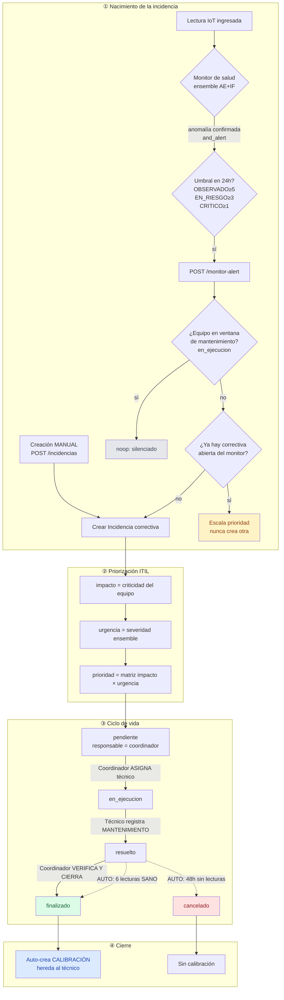
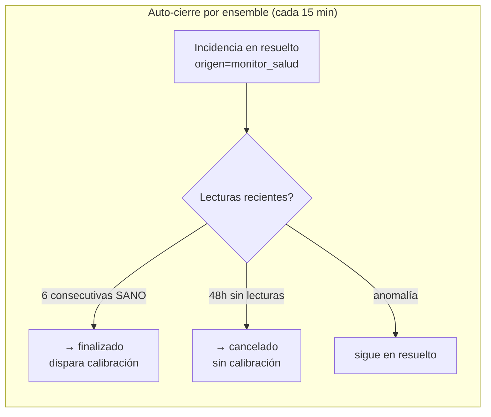
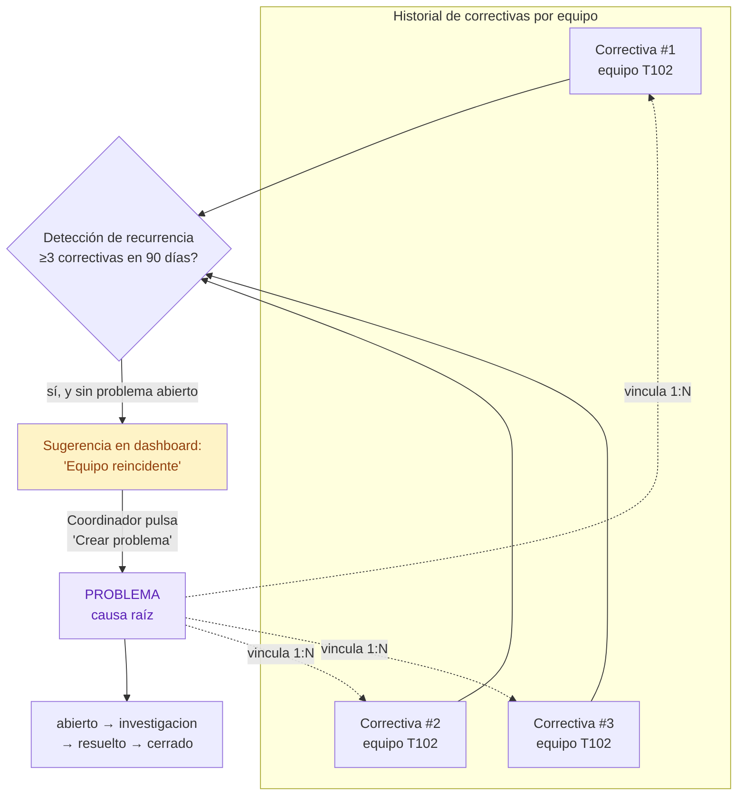
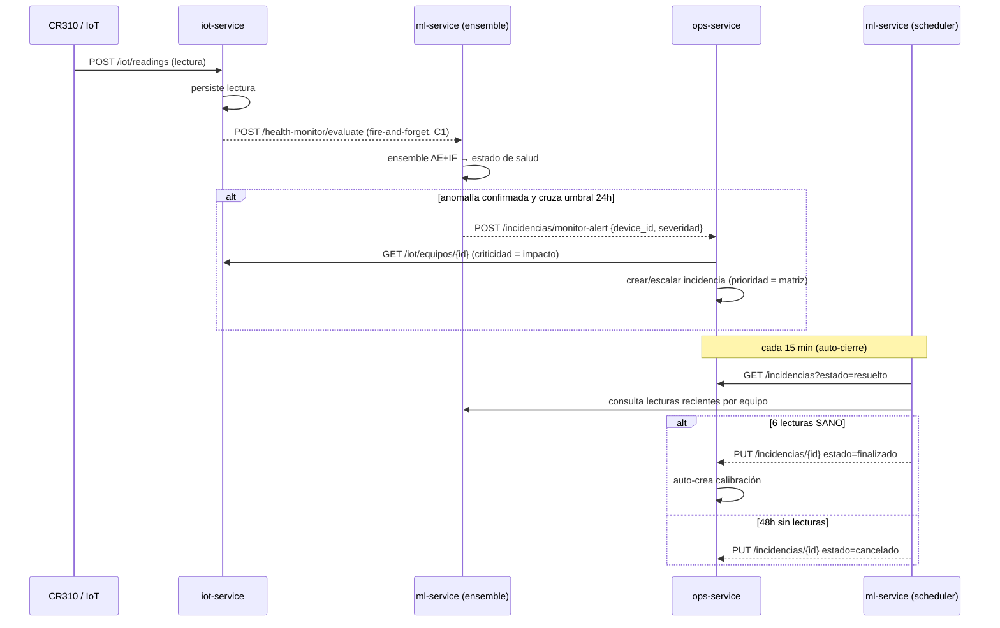
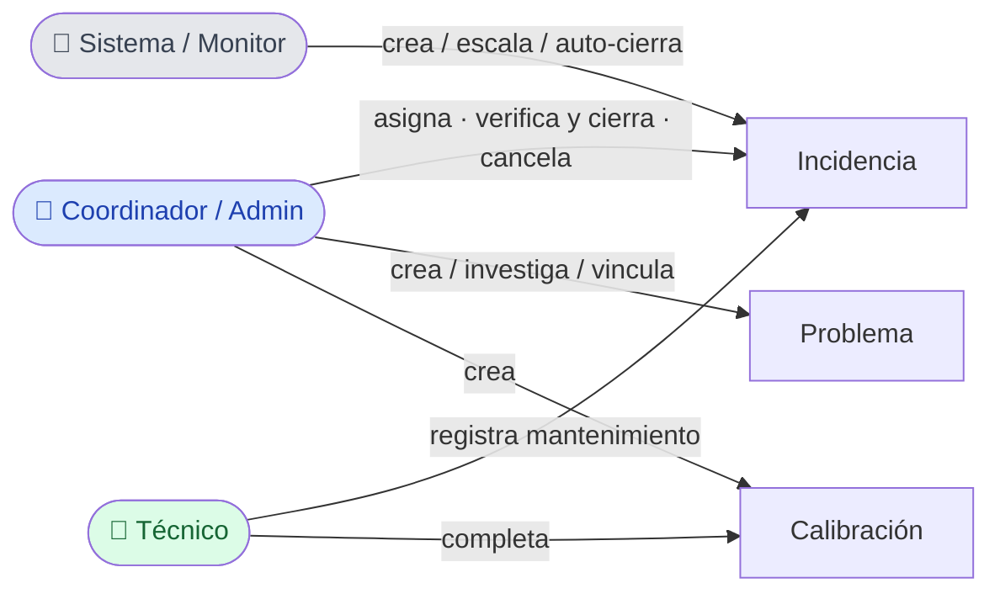

# Flujo ITIL v4 — Gestión de Incidentes y Problemas (implementado)

Documento de visualización para el equipo. Describe el flujo **tal como está
implementado** en el sistema (no ITIL genérico). Los diagramas son Mermaid — se
renderizan directo en GitHub/GitLab/VS Code.

> Fuentes: `ops-service/app/services/incidencia_service.py`, `priority_service.py`,
> `mantenimiento_service.py`, `problema_service.py`, `ml-service/app/services/
> health_service.py` + `autoclose_service.py`. Ver también
> `docs/spec-itil-v4-incidencias.md` y `docs/regla-consolidacion-alertas.md`.

---

## 1. Conceptos base

| Concepto | Qué es | Pregunta que responde | Dueño |
|---|---|---|---|
| **Incidente** (Incidencia) | Interrupción/degradación concreta de un equipo | ¿Qué está roto **ahora**? | Técnico (lo repara) |
| **Problema** | Causa raíz de incidentes que se **repiten** | ¿**Por qué** se sigue rompiendo? | Coordinador (lo investiga) |

Un **Problema** agrupa 1..N **Incidencias** (relación 1:N vía `incidencia.problema_id`).

**Roles:**
- **Coordinador / Administrador** — asigna, verifica y cierra, cancela, gestiona
  problemas y calibraciones.
- **Técnico** — registra el mantenimiento correctivo y completa calibraciones; solo
  ve las incidencias asignadas a él.
- **Sistema (monitor de salud)** — crea/escala incidencias automáticamente y auto-cierra.

---

## 2. Ciclo de vida de la Incidencia (máquina de estados)

Cinco estados. Las transiciones están validadas (`VALID_TRANSITIONS`): una transición
inválida devuelve HTTP 400. Cada transición sella un timestamp SLA.

**Transiciones — quién y qué las dispara:**

| Transición | Acción que la dispara | Rol | Timestamp |
|---|---|---|---|
| `pendiente → en_ejecucion` | Asignar `responsable_id` (auto-avanza) | Coordinador/Admin | `fecha_asignacion` |
| `en_ejecucion → resuelto` | Técnico envía mantenimiento (`submit_mantenimiento`) | Técnico | `fecha_resolucion` |
| `resuelto → finalizado` | "Verificar y cerrar" **o** auto-cierre por ensemble | Coordinador/Admin **o** sistema | `fecha_cierre` |
| `* → cancelado` | "Cancelar" **o** auto-cancela (48h sin lecturas) | Coordinador/Admin **o** sistema | `fecha_cierre` |

- **Terminal:** `finalizado`, `cancelado`.
- **Abierto** (para dedup): `pendiente`, `en_ejecucion`, `resuelto`.
- **Ventana de mantenimiento** (silencia el monitor): solo `en_ejecucion`.

---

## 3. Flujo end-to-end (nacimiento → cierre)

**Reglas clave del nacimiento:**
- **Dos orígenes** (`origen`): `monitor_salud` (automático) o `manual`.
- **Regla de consolidación:** un solo incidente correctivo abierto por equipo del
  monitor. Si ya hay uno abierto → **escala prioridad** (nunca baja, nunca duplica).
- **Ventana de mantenimiento (C9):** si el equipo tiene una correctiva `en_ejecucion`
  (técnico interviniendo), el monitor hace **noop total** — las anomalías durante la
  intervención son esperadas.

---

## 4. Matriz de prioridad (impacto × urgencia)

La prioridad **no se fija a mano**: se deriva. El **impacto** viene de la criticidad
del equipo (estación crítica vs secundaria); la **urgencia** de la severidad del
ensemble.

**Severidad del ensemble → urgencia:**

| Severidad | Urgencia |
|---|---|
| `CRITICO` | alta |
| `EN_RIESGO` | media |
| `OBSERVADO` | baja |

**Matriz `prioridad = f(impacto, urgencia)`:**

| impacto ↓ / urgencia → | **alta** | **media** | **baja** |
|---|---|---|---|
| **alta** | 🔴 alta | 🔴 alta | 🟡 media |
| **media** | 🔴 alta | 🟡 media | 🟢 baja |
| **baja** | 🟡 media | 🟢 baja | 🟢 baja |

> Ejemplo: estación crítica (impacto alta) + anomalía OBSERVADO (urgencia baja) →
> prioridad **media**. La prioridad se re-deriva si cambia impacto o urgencia.

---

## 5. Automatizaciones del sistema

- **Auto-crear calibración:** cuando una correctiva pasa a `finalizado`, se crea
  automáticamente una incidencia de **calibración** que **hereda al técnico** de la
  correctiva (aparece en "sus" calibraciones).
- **Auto-cierre por ensemble** (`autoclose_service`, cada 15 min): una correctiva del
  monitor en `resuelto` se cierra sola cuando el equipo confirma recuperación
  (**6 lecturas SANO consecutivas** → `finalizado`), o se cancela si lleva **48h sin
  lecturas** (→ `cancelado`, sin calibración porque no hubo verificación real).

---

## 6. Incidente vs Problema + detección de recurrencia

- La detección **SUGIERE** (no crea automáticamente): un Problema implica análisis
  humano de la causa raíz. Umbral configurable (por defecto **≥3 correctivas / 90 días**;
  cuenta abiertas + cerradas).
- **Excluye** equipos que ya tienen un Problema `abierto`/`investigacion` (no re-sugiere
  lo ya gestionado).
- Al pulsar "Crear problema", el sistema lo crea **pre-llenado** (equipo + título/descr)
  y **vincula automáticamente** las incidencias recurrentes.
- **Valor para OEFA / ISO 17025:** el Problema es la evidencia documentada de análisis
  de causa y acción correctiva, y habilita decisiones que un incidente aislado no
  permite (reemplazar el equipo, detectar lote defectuoso, ajustar calibración).

**Estados del Problema:** `abierto → investigacion → resuelto → cerrado`.

---

## 7. Cadena entre servicios (secuencia)

Todas las llamadas cross-service del monitor son **fire-and-forget / tolerantes a
fallos**: si un servicio no responde, la ingesta y el ciclo operativo no se rompen.

---

## 8. Resumen: quién hace qué

| Acción | Coordinador/Admin | Técnico | Sistema |
|---|:---:|:---:|:---:|
| Crear incidencia (manual) | ✅ | — | — |
| Crear incidencia (monitor) | — | — | ✅ |
| Asignar / Re-asignar técnico | ✅ | — | — |
| Registrar mantenimiento | — | ✅ | — |
| Verificar y cerrar | ✅ | — | ✅ (auto) |
| Cancelar | ✅ | — | ✅ (auto) |
| Crear/gestionar Problema | ✅ | — | (sugiere) |
| Completar calibración | ✅ | ✅ | — |
| Escalar prioridad | — | — | ✅ |

---

*Diagramas fieles a la implementación al 2026-07-05. Si el flujo cambia, actualizar
este documento junto con `docs/spec-itil-v4-incidencias.md`.*
